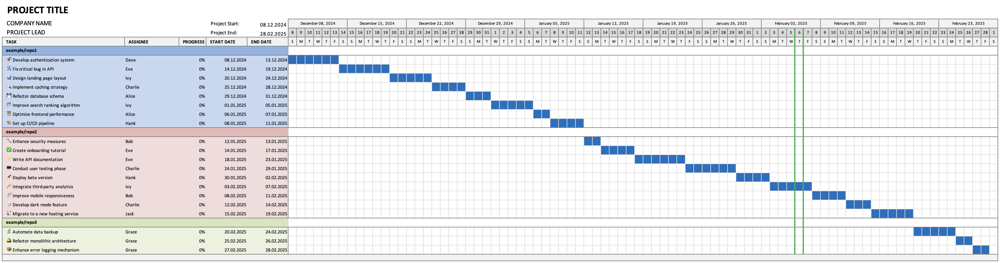

# 📌 Roadmap2XLSX <!-- omit in toc -->

[](https://www.npmjs.com/package/roadmap2xlsx)
[](https://github.com/imbenwolf/roadmap2xlsx/actions/workflows/ci-cd.yaml)
[](LICENSE)
[](https://www.npmjs.com/package/roadmap2xlsx)

Roadmap2XLSX converts your GitHub project roadmap (in TSV format) into a beautifully formatted Excel Gantt chart.



> [!NOTE]
> The repository's [example folder](./example/) contains the sample input ([`roadmap.tsv`](./example/roadmap.tsv)) and the generated demo output ([`gantt.xlsx`](./example/gantt.xlsx))

## 📚 Table of Contents <!-- omit in toc -->

- [🚀 Features](#-features)
- [📥 How to Export Your GitHub Roadmap Data](#-how-to-export-your-github-roadmap-data)
- [📦 Installation \& Usage](#-installation--usage)
- [🔧 Development](#-development)
- [📁 Project Structure](#-project-structure)
- [📜 License \& Credits](#-license--credits)

## 🚀 Features

- **📝 TSV Parsing:** Reads GitHub project roadmaps exported as TSV.
- **🗂️ Task Grouping:** Automatically groups tasks by repository.
- **📆 Gantt Timeline:** Generates a full-week Gantt chart.
- **🎨 Conditional Formatting:** Creates a polished Excel output.
- **⚡ CLI Simplicity:** Run directly via `npx roadmap2xlsx` or install globally.

## 📥 How to Export Your GitHub Roadmap Data

Refer to GitHub's guide on [Exporting Your Projects Data](https://docs.github.com/en/issues/planning-and-tracking-with-projects/managing-your-project/exporting-your-projects-data).

## 📦 Installation & Usage

**Run without installation:**

```sh
npx roadmap2xlsx --input path/to/tasks.tsv --output path/to/roadmap.xlsx
```

**Or install globally:**

```sh
npm install -g roadmap2xlsx

roadmap2xlsx --input path/to/tasks.tsv --output path/to/roadmap.xlsx
```

## 🔧 Development

```sh
# Install dependencies
pnpm install

# Run the CLI in development mode
pnpm dev

# Build the project
pnpm build

# Lint & format
pnpm lint
pnpm lint:fix
pnpm format
pnpm format:fix

# Run tests
pnpm test
```

## 📁 Project Structure

- 🏗️ **src/cli.ts** – CLI entry point
- 📄 **src/parse.ts** – TSV parsing logic
- 📏 **src/config/** – Style, layout, and color configurations
- 📊 **src/roadmap/** – Excel Gantt chart generation

## 📜 License & Credits

📝 Licensed under MIT. Created by **Ben Wolf**.

🙏 This project leverages **ExcelJS** for Excel file generation, **commander** for CLI argument parsing, and **csv-parser** for TSV/CSV processing.

✨ Contributions are welcome! Open an issue or submit a pull request on GitHub.
